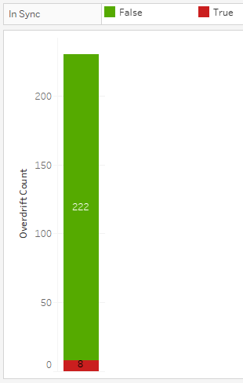
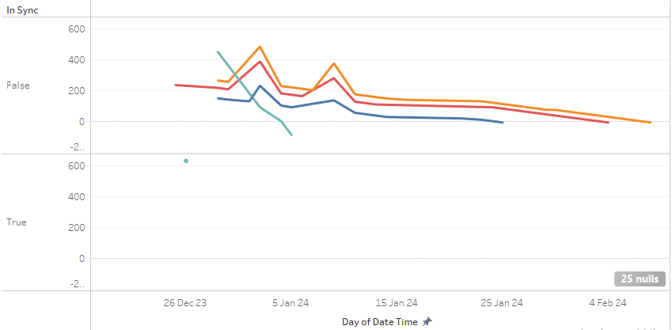
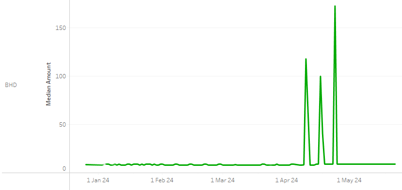
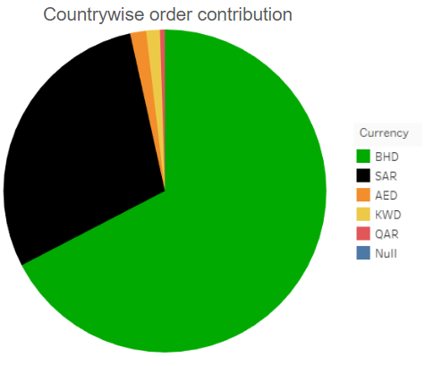
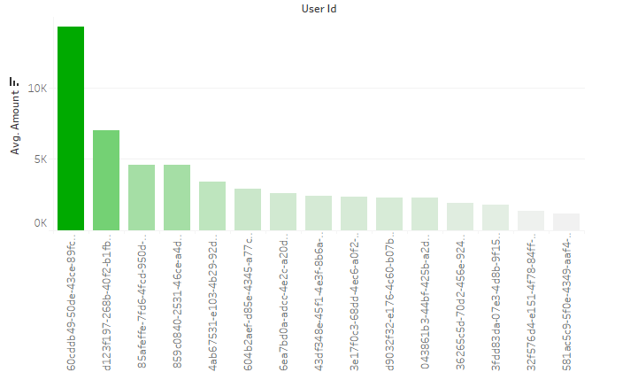
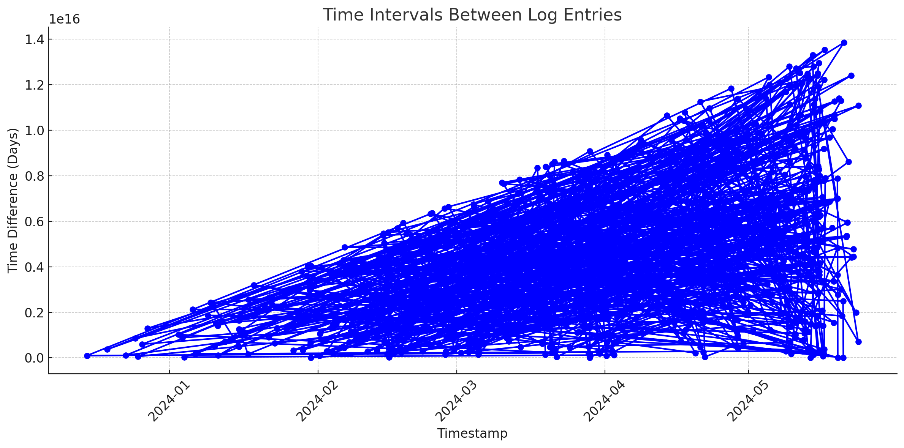
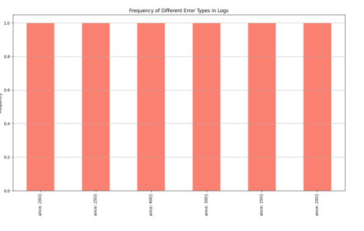

docker pull arfatshaikh/thecaloproject:v1.0
docker run arfatshaikh/thecaloproject:v1.0

Python 2.7 Python 3.5 License
# The Calo Project

This project is based on transaction logs and aims to generate 
insights into subscriber payment trends. It includes a specialized 
sub-application  **Overdraft Predictor Pro (OPP)**, designed to 
predict and handle overdrafts. By automating the reconciliation process and
identifying potential issues early on, OPP seeks to prevent substantial 
financial losses and enhance operational efficiency.

## To Run The Program

### Docker
    docker pull arfatshaikh/thecaloproject:v1.0
    docker run arfatshaikh/thecaloproject:v1.0

Alternatively, the source code is available on
[The Calo Project](https://github.com/shaikharfat/TheCaloProject).


## Tools Used
* Python 3.8
* Docker
* Tableau

## Project Flow

### Data
We make use of the logs collected from AWS lambda responsible for 
updating the subscribers balance whenever a transaction happens 
(credit or debit).

``` yaml
2024-02-13T21:01:04.046Z INIT_START Runtime Version: nodejs:20.v15	Runtime Version ARN: arn:aws:lambda:us-east-1::runtime:379cd8c4d157c2e16f1b841486b613da2188da597609ef24d67497ad9c22a53e

2024-02-13T21:01:04.792Z START RequestId: 405bb962-f57b-521d-81a1-e7272fbf6077 Version: $LATEST

2024-02-13T21:01:04.936Z 2024-02-13T21:01:04.936Z	405bb962-f57b-521d-81a1-e7272fbf6077	INFO	Processing message 861bec95-b670-4f2a-acf9-19d5bdd7cbe5

2024-02-13T21:01:05.050Z 2024-02-13T21:01:05.050Z	405bb962-f57b-521d-81a1-e7272fbf6077	INFO	Start syncing the balance {
  transaction: {
    id: '01HPJ4BT09Y3GYQQZD1XFEGDHT',
    type: 'DEBIT',
    source: 'MANUAL_DEDUCTION',
    action: 'DELIVERY_DEDUCTION',
    userId: 'df06a87e-a8bd-4aa4-b6f0-c16c1be9bb02',
    paymentBalance: 16.4,
    updatePaymentBalance: true,
    metadata: '{"walletId":"wallet#df06a87e-a8bd-4aa4-b6f0-c16c1be9bb02","deliveryId":"ef86902c-c781-4769-8454-59c85e9cfc33","walletSk":"ef86902c-c781-4769-8454-59c85e9cfc33"}',
    currency: 'BHD',
    amount: 8,
    vat: 0,
    oldBalance: 24.4,
    newBalance: 16.4
  }
}

2024-02-13T21:01:05.242Z 2024-02-13T21:01:05.242Z	405bb962-f57b-521d-81a1-e7272fbf6077	INFO	SubscriptionBalanceUpdated event published

2024-02-13T21:01:05.410Z END RequestId: 405bb962-f57b-521d-81a1-e7272fbf6077
```

### Data Staging Stage (data_staging.py)
In this stage, the data undergoes cleaning and preprocessing. The main steps involved are:

**Dataframe Preparation:**

The dataframe consists of filenames and their corresponding data.

**Filtering Transaction Logs:**

Initially, we filter out the logs that contain any "transaction" details to create a dedicated dataframe for these transactions.

**Splitting Transactions:**

Within each row of the filtered dataframe, there can still be multiple "transactions". To manage this:
We further split the transactions based on "**START RequestId**" and "**END RequestId**".
Any remaining parts are split using the "**Processing message**".
This process ensures that the data is properly structured and ready for the next stages.

### Creating the RICH Data

This stage involves extracting meaningful data from the logs. The following columns are derived from the log messages:

```text


date_time: Extracted from the top of the log message, representing the log start time.
id: Taken from the transaction dictionary within the log, representing the log ID.
type: From the transaction dictionary within the log. Possible values include CREDIT, DEBIT.
source: From the transaction dictionary within the log. Possible values include MANUAL_ADDITION, PAYMENT, etc.
action: From the transaction dictionary within the log. Possible values include CUSTOMERS_CALO_EXPERIMENTS, RENEW_SUBSCRIPTION, etc.
userId: Extracted from the transaction dictionary within the log, representing the user ID.
in_sync: Indicates whether the balance is in sync, used to handle overdrafts and early interventions in preventing overdrafts.
Other columns from the transaction dictionary: paymentBalance, updatePaymentBalance, currency, amount, vat, oldBalance, newBalance
```
This structured approach ensures that all relevant information is captured and ready for further analysis.

## Overdraft Predictor Pro

### Overview

The Overdraft Predictor Pro (OPP) system is designed to detect accounts that are out of sync and potentially heading towards overdraft. The system leverages error messages received within transaction logs to identify discrepancies and predict overdrafts.

### Key Features
**1. Error Detection:**

The system identifies error messages in the logs that indicate an out-of-sync status for accounts.
When an error message is detected, the in_sync flag is set to False.

**2. Correlation Analysis:**

A direct correlation exists between the in_sync flag and overdraft occurrences.
This correlation is demonstrated by analyzing the overdraft_df dataframe, which shows that over 99% of negative paymentBalance (indicative of overdraft) entries have the in_sync flag set to False.



Overdraft DataFrame (**overdraft_df**) as shown below:

Contains records of transactions where the **paymentBalance** is negative.
Analysis of this dataframe shows a strong correlation between the **in_sync** flag being False and the occurrence of overdrafts.

| userId                               |   paymentBalance | in_sync   | date_time                        |
|:-------------------------------------|-----------------:|:----------|:---------------------------------|
| 00b2df99-692a-45c1-b277-854a63b3a168 |           -1.8   | False     | 2024-01-14 21:01:06.853000+00:00 |
| 07cb8a00-acd7-4e6c-b4b1-ba09fecd14a4 |           -9     | False     | 2024-02-04 21:01:15.134000+00:00 |
| 1b5748cb-c677-44ab-9d61-940e554fc014 |           -4     | False     | 2024-01-20 21:02:38.440000+00:00 |
| 20f25ac8-8c5b-4ddf-a655-12257aed6fff |           -6     | False     | 2024-02-11 21:01:19.128000+00:00 |
| 258416ee-c0ce-47d0-b38d-7b2372d012b0 |           -8.69  | False     | 2024-01-29 21:01:32.116000+00:00 |
| 258416ee-c0ce-47d0-b38d-7b2372d012b0 |          -27.69  | False     | 2024-01-30 21:01:13.786000+00:00 |
| 258416ee-c0ce-47d0-b38d-7b2372d012b0 |          -46.69  | False     | 2024-02-02 21:01:09.281000+00:00 |
| 258416ee-c0ce-47d0-b38d-7b2372d012b0 |          -65.69  | False     | 2024-02-03 21:01:03.729000+00:00 |


**3. Predictive Capability:**

The in_sync flag's transition to False often precedes the actual occurrence of an overdraft.
By analyzing the user IDs in the random (overdraft) user list, it is evident that the in_sync flag predicts overdraft situations well before they manifest.

A sample set of user IDs who have experienced overdrafts.
Analysis shows that the in_sync flag for these users transitions to False prior to the overdraft, demonstrating the predictive nature of the OPP.




| userId                               |   paymentBalance | in_sync   | date_time                        |
|:-------------------------------------|-----------------:|:----------|:---------------------------------|
| 00b2df99-692a-45c1-b277-854a63b3a168 |          nan     | True      | 2023-12-14 21:01:26.781000+00:00 |
| 00b2df99-692a-45c1-b277-854a63b3a168 |          nan     | True      | 2023-12-17 21:03:42.785000+00:00 |
| 00b2df99-692a-45c1-b277-854a63b3a168 |          nan     | True      | 2023-12-19 00:11:48.599000+00:00 |
| 00b2df99-692a-45c1-b277-854a63b3a168 |          nan     | True      | 2023-12-21 21:01:16.565000+00:00 |
| 00b2df99-692a-45c1-b277-854a63b3a168 |          nan     | True      | 2023-12-25 21:01:41.008000+00:00 |
| 00b2df99-692a-45c1-b277-854a63b3a168 |           46.2   | False     | 2023-12-29 21:01:27.681000+00:00 |
| 00b2df99-692a-45c1-b277-854a63b3a168 |           38.2   | False     | 2024-01-02 21:01:10.877000+00:00 |
| 00b2df99-692a-45c1-b277-854a63b3a168 |           30.2   | False     | 2024-01-07 21:01:11.666000+00:00 |
| 00b2df99-692a-45c1-b277-854a63b3a168 |           22.2   | False     | 2024-01-09 21:01:08.954000+00:00 |
| 00b2df99-692a-45c1-b277-854a63b3a168 |           14.2   | False     | 2024-01-11 21:01:07.695000+00:00 |
| 00b2df99-692a-45c1-b277-854a63b3a168 |            6.2   | False     | 2024-01-12 21:01:05.643000+00:00 |
| 00b2df99-692a-45c1-b277-854a63b3a168 |           -1.8   | False     | 2024-01-14 21:01:06.853000+00:00 |

## Data Visualisation

### Eid al-Fitr Holiday Impact:
The visualizations show a significant upward trend in orders during the EID holidays, leading to the largest spike in orders observed. This highlights the impact of major events like EID on order volumes.



**Trend Analysis:**
The spike during EID suggests that similar events can have a substantial effect on customer behavior and order trends, indicating the importance of preparing for such events.

### Countrywise Order Contribution
The pie chart illustrates the contribution of different currencies to the overall order volume, providing insights into the geographic distribution of orders.



Key Observations:
The majority of orders are contributed by BHD (Bahraini Dinar), as indicated by the large green segment.
Other significant contributors include SAR (Saudi Riyal) and AED (United Arab Emirates Dirham).
Minor contributions come from KWD (Kuwaiti Dinar) and QAR (Qatari Riyal).
A portion of the data is marked as Null, indicating orders with unspecified or unknown currency.
This visualization helps in understanding the distribution of orders across different countries, allowing for targeted marketing and resource allocation based on regional demand.
### Top Calo User


This bar chart visualizes the average amount spent by different users, identified by their unique User IDs. The chart allows for quick comparison of average spending across users, highlighting the top spenders.

## Anomalities
### Timestamp Anomalies:

The analysis identified several instances of unusually long intervals between log entries. These gaps may indicate periods of inactivity or potential issues with logging mechanisms.

Each point represents the time difference between consecutive log entries, plotted over the timeline. Unusually long intervals are easily identifiable as spikes in the graph.

### Error Anomalities:

The logs contain messages indicating subscription balance and payment balance synchronization issues.


The identified errors occurred multiple times, with specific details about transaction IDs, user IDs, and balances.

## Future Improvements
* Implement more granular logging to capture finer details of each transaction. This will help in identifying and resolving issues more effectively.
* Introduce structured logging formats (e.g., JSON) for easier parsing and analysis.

### Overdraft Predictor Pro Enhancements
* Create a notification based system to notify the responsible personel
* Use AWS SNS (Simple Notification Service) to automate the notification process for detected errors. 